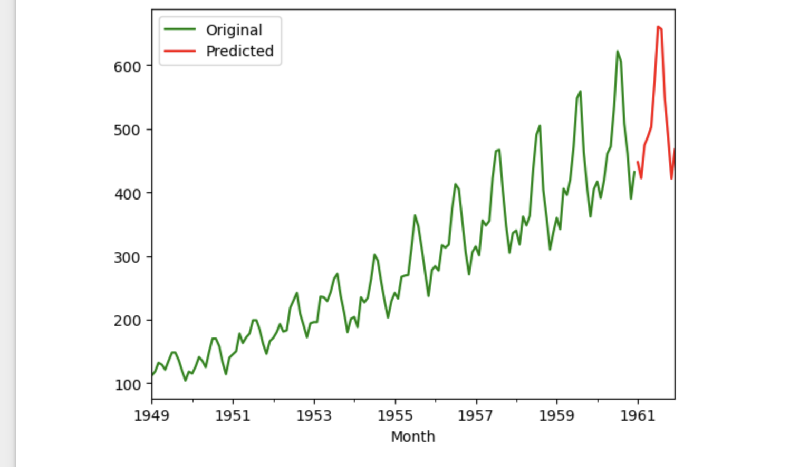

# AirPassengers Forecast with SARIMAX

## 📌 Project Overview
This project uses the classic **AirPassengers** dataset to forecast the number of airline passengers for the next 12 months using the **SARIMAX** time series model.

The dataset contains monthly totals of international airline passengers from 1949 to 1960.

---

## 📂 Dataset
- **Columns**: `Month`, `Passengers`
- **Period**: 12 years (1949–1960)

---

## ⚙️ Methodology
1. Data loading & preprocessing
2. Exploratory Data Analysis (EDA)
3. Seasonal decomposition to analyze trend & seasonality
4. Model selection using `auto_arima`
5. SARIMAX model training
6. Forecasting next 12 months
7. Visualization of results

---

## 📊 Results
- **Model**: SARIMAX `(p,d,q)x(P,D,Q,12)`
- Predicted passenger growth trend for next 12 months
- Seasonal pattern preserved in forecast

## 📸 Results Visualization

Here’s the SARIMAX forecast compared to the original data:

